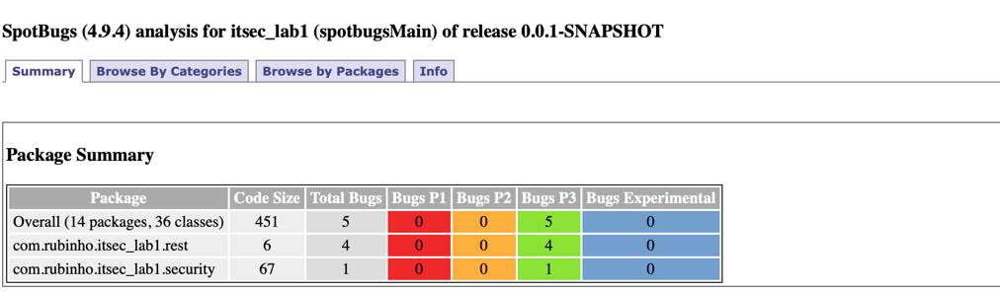
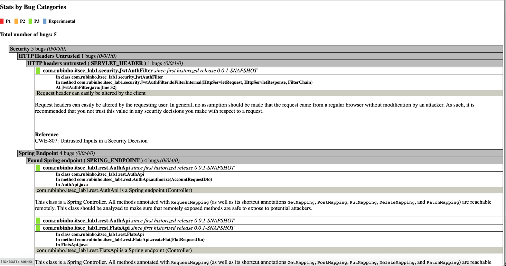
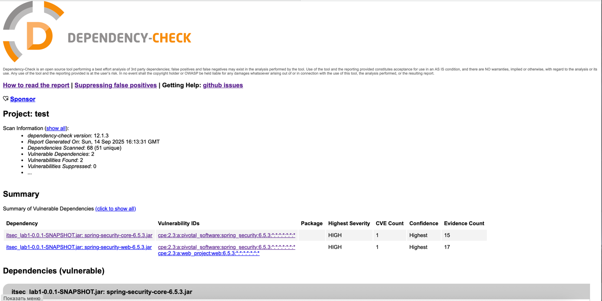

# Рубин М.Д., P3411, лабораторная №1

## Содержание

1. [Описание проекта](#описание-проекта)
2. [Описание API](#описание-api)
    - 3.1. [Endpoints](#endpoints)
    - 3.2. [Schema](#schema)
        - 3.2.1. [Flat](#flat)
        - 3.2.2. [Credentials](#credentials)
    - 3.3. [Security](#security)
    - 3.4. [Пример запросов](#пример-запросов)
3. [Реализованные меры защиты](#реализованные-меры-защиты)
    - 4.1. [Защита от SQLi](#защита-от-sqli)
    - 4.2. [Защита от XSS](#защита-от-xss)
    - 4.3. [Как реализована аутентификация](#как-реализована-аутентификация)
4. [Отчет SAST (spotbugs)](#отчет-sast-spotbugs)
5. [Отчет SCA (OWASP Dependency-Check)](#отчет-sca-owasp-dependency-check)

## Описание проекта

Проект представляет собой API для простого взаимодействия (получение и добавление) с коллекцией, содержащей информацию
о квартирах. В REST API внедрены базовые меры защиты и настрое GitHub Actions pipeline с security-сканерами.

## Описание API

### Endpoints

- GET /api/data — получить информацию о всех созданных квартирах (всеми пользователями). Доступно авторизованным пользователям
- POST /api/data — добавить квартиру в базу. Доступно авторизованным пользователям
- POST /auth/register — зарегистрироваться (по логину и паролю)
- POST /auth/login - авторизоваться (по логину и паролю)

### Schema

#### Flat

Для создания квартиры необходимо передать json объект следующего вида:

```json
{
  "address": "Улица",
  "squareMeters": 100,
  "cost": "20000000"
}
```

#### Credentials

Для регистрации/авторизации необходимо передать json объект следующего вида:

```json
{
  "login": "admin",
  "password": "admin"
}
```

### Security

Доступ к /api методам есть только у авторизованных пользователей. Доступ осуществляется посредством JWT-токена.
JWT-токен передается в заголовке запроса

### Пример запросов

Регистрация
```bash
curl http://localhost:8080/auth/register \
--header 'Content-Type: application/json' \
--data '{
    "login": "admin",
    "password": "admin"
}'
```

Авторизация
```bash
curl http://localhost:8080/auth/login \
--header 'Content-Type: application/json' \
--data '{
    "login": "admin",
    "password": "admin"
}'
```

Добавление квартиры
```bash
curl http://localhost:8080/api/data \
--header 'Content-Type: application/json' \
--header 'Authorization: Bearer $API_TOKEN' \
--data '{
    "address": "Улица",
    "squareMeters": 100,
    "cost": "20000000"
}'
```

Получение квартир
```bash
curl http://localhost:8080/api/data \
--header 'Authorization: Bearer $API_TOKEN'
```

## Описание проекта

Проект представляет собой API для простого взаимодействия (получение и добавление) с коллекцией, содержащей информацию 
о квартирах. В REST API внедрены базовые меры защиты и настрое GitHub Actions pipeline с security-сканерами.

## Описание API

### Endpoints

- GET /api/data — получить информацию о всех созданных квартирах (всеми пользователями). Доступно авторизованным пользователям
- POST /api/data — добавить квартиру в базу. Доступно авторизованным пользователям
- POST /auth/register — зарегистрироваться (по логину и паролю)
- POST /auth/login - авторизоваться (по логину и паролю)

### Schema

#### Flat

Для создания квартиры необходимо передать json объект следующего вида:

```json
{
  "address": "Улица",
  "squareMeters": 100,
  "cost": "20000000"
}
```

#### Credentials

Для регистрации/авторизации необходимо передать json объект следующего вида:

```json
{
  "login": "admin",
  "password": "admin"
}
```

### Security 

Доступ к /api методам есть только у авторизованных пользователей. Доступ осуществляется посредством JWT-токена.
JWT-токен передается в заголовке запроса

### Пример запросов

Регистрация
```bash
curl http://localhost:8080/auth/register \
--header 'Content-Type: application/json' \
--data '{
    "login": "admin",
    "password": "admin"
}'
```

Авторизация
```bash
curl http://localhost:8080/auth/login \
--header 'Content-Type: application/json' \
--data '{
    "login": "admin",
    "password": "admin"
}'
```

Добавление квартиры
```bash
curl http://localhost:8080/api/data \
--header 'Content-Type: application/json' \
--header 'Authorization: Bearer $API_TOKEN' \
--data '{
    "address": "Улица",
    "squareMeters": 100,
    "cost": "20000000"
}'
```

Получение квартир
```bash
curl http://localhost:8080/api/data \
--header 'Authorization: Bearer $API_TOKEN'
```

## Реализованные меры защиты

### Защита от SQLi

Используется Spring Data Repository

```java
@Component
public interface AccountRepository extends JpaRepository<Account, Long> {
    Optional<Account> findByLogin(String login);

    boolean existsByLogin(String login);
}
```

```java
@Repository
public interface FlatRepository extends JpaRepository<Flat, Long> {
}
```

### Защита от XSS

Пользовательские данные (данные о квартирах) экранируется средствами Spring (HtmlUtils.htmlEscape()).

```java
    @Override
    public Flat toEntity(FlatRequestDto flatRequestDto) {
        return Flat.builder()
                .address(HtmlUtils.htmlEscape(flatRequestDto.getAddress())) // String
                .cost(flatRequestDto.getCost()) // Integer
                .squareMeters(flatRequestDto.getSquareMeters()) // Float
                .build();
    }
```

### Как реализована аутентификация

1) Приходит запрос на регистрацию/авторизацию
2) [AuthService](src/main/java/com/rubinho/itsec_lab1/services/AuthService.java) 
сравнивает hash полученного пароля с хэшем, лежащем в базе (используется PasswordEncoder)
3) [UserAuthProvider](src/main/java/com/rubinho/itsec_lab1/security/UserAuthProvider.java)
выписывает JWT-токен
4) Приходит запрос по /api с JWT-токеном
5) [JWTAuthFilter](src/main/java/com/rubinho/itsec_lab1/security/JwtAuthFilter.java)
достает Authorization header и ищет в нем Bearer схему
6) [UserAuthProvider](src/main/java/com/rubinho/itsec_lab1/security/UserAuthProvider.java)
   валидирует JWT-токен

## Отчет SAST (spotbugs)





## Отчет SCA (OWASP Dependency-Check)

